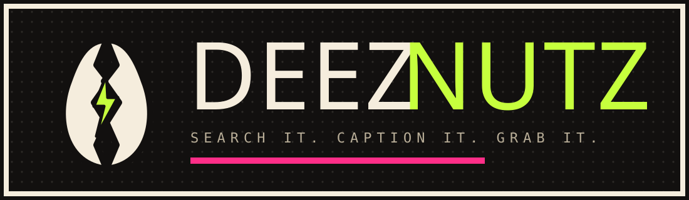

<p align="center">
  
</p>

<h1 align="center">Deez Nutz</h1>

<p align="center">
  A neo brutalist arcade for downloading the internet's finest memes and gifs.<br>
  Original art, rendered on the fly, free to grab.
</p>

<p align="center">
  <b><a href="https://deez-nutzz.vercel.app">deez-nutzz.vercel.app</a></b>
</p>

<p align="center">
  <a href="#license"></a>
  
  
  
  
  
  <a href="https://vercel.com/new/clone?repository-url=https://github.com/Abudora-0/Deez-Nutz"></a>
  
</p>

<p align="center">
  <b>Tags:</b>
  memes &middot; gifs &middot; meme gallery &middot; reaction images &middot; nextjs &middot; react &middot; typescript &middot; tailwindcss &middot; framer motion &middot; vercel &middot; svg &middot; download
</p>

---

## What is this

Deez Nutz is a single page meme and gif arcade with a look that does not come from
a component library. Hard shadows, chunky borders, oversized type, halftone texture,
a CRT wash, and every control tuned to match: the scrollbar, the counters, the
dropdowns, the toggles, and the cursor.

The gallery blends four sources across four tabs (Originals, Templates, GIFs, Fresh):

- **Originals.** Hand written art from a compact spec. `lib/art.ts` turns each entry
  in `data/memes.json` into a finished 1200 by 1200 SVG, animated when the spec asks
  for it. Downloads rasterize to PNG in the browser or hand you the animated SVG.
- **Templates.** The top blank templates from imgflip, captioned right in the browser
  on a canvas. No account, no watermark, no server round trip.
- **GIFs.** Live trending GIFs from Giphy.
- **Fresh.** Top image posts of the day from an allowlist of meme subreddits, SFW only,
  each credited back to its thread.

Every network source is optional and fails soft. Set none of the keys and the site
still runs on the originals and the templates.

## Features

- **Caption studio.** Open any template, type your lines, watch the canvas update,
  and download the finished meme.
- **Animated logo.** A peanut that cracks open on load and on hover, with a kinetic
  wordmark.
- **Themed controls.** Custom scrollbar, a scroll progress bar, rolling odometer
  counters, spring loaded dropdowns, chunky toggles, a crosshair cursor, and themed
  context menus. Five swappable accent colors, remembered per device.
- **Command palette.** Press `K` anywhere for fuzzy search, quick navigation, and
  one shot actions.
- **One click download.** Grab a PNG or an animated SVG, copy the image to the
  clipboard, or copy a share link. A confetti burst and a live counter come free.
- **Download packs.** Flip on pack mode, select as many memes as you like, and pull
  them all down as a single zip.
- **Favorites.** Tap the nut on any card to build a stash, saved in local storage,
  with its own page and a one click zip.
- **Meme of the day.** A deterministic pick that rolls over at midnight UTC.
- **Chaos mode.** Reshuffles and rattles the whole grid. Do not press it.
- **Deep links and modals.** Opening a card from the grid shows a shareable modal
  without leaving the page. The same URL loads a full page on refresh, with its own
  Open Graph image.
- **Keyboard first.** Arrow keys move through the grid, `D` downloads the focused
  meme, `F` favorites it, `Esc` closes everything.
- **Konami code.** Up up down down left right left right b a.
- **Accessible and honest.** Reduced motion is respected everywhere, there is no
  account, no database, and no tracking.

## Tech stack

| Area        | Choice                                              |
| ----------- | --------------------------------------------------- |
| Framework   | Next.js 16 App Router, React 19                     |
| Language    | TypeScript, strict                                  |
| Styling     | Tailwind CSS 4 with a custom token layer            |
| Animation   | Motion (Framer Motion)                              |
| Primitives  | Radix UI (select, switch, context menu), cmdk       |
| Packaging   | JSZip for download packs                            |
| Art         | A dependency free SVG renderer in `lib/art.ts`      |
| Content     | imgflip (no key), Giphy, Reddit (optional keys)           |
| Fonts       | Archivo Black, Space Grotesk, JetBrains Mono, self hosted |
| Hosting     | Vercel, zero config                                 |

## Screenshots

> Drop your own captures in `docs/` and link them here.

| Gallery | Meme view | Command palette |
| ------- | --------- | --------------- |
| `docs/screenshot-gallery.png` | `docs/screenshot-meme.png` | `docs/screenshot-command.png` |

## Getting started

```bash
git clone https://github.com/Abudora-0/Deez-Nutz.git
cd Deez-Nutz
npm install
npm run dev
```

Open [http://localhost:3000](http://localhost:3000).

### Environment

All optional. Copy `.env.example` to `.env.local` and fill in whichever live sections
you want. On Vercel, add the same values under Project Settings, Environment Variables.

| Variable | Unlocks | Where to get it |
| --- | --- | --- |
| `GIPHY_API_KEY` | the GIFs tab | [developers.giphy.com](https://developers.giphy.com) |
| `REDDIT_CLIENT_ID` and `REDDIT_CLIENT_SECRET` | the Fresh tab | a "script" app at [reddit.com/prefs/apps](https://www.reddit.com/prefs/apps) |

With none of them set the site runs on the originals and the imgflip templates.

### Scripts

| Command             | Does                          |
| ------------------- | ----------------------------- |
| `npm run dev`       | Start the dev server          |
| `npm run build`     | Production build              |
| `npm run start`     | Serve the production build    |
| `npm run lint`      | ESLint                        |
| `npm run typecheck` | TypeScript, no emit           |

## Project structure

```
app/
  layout.tsx              root shell, fonts, providers, chrome
  page.tsx                hero plus the gallery
  meme/[slug]/            full meme page, generateStaticParams, OG image
  @modal/(.)meme/[slug]/  intercepting modal for the same route
  favorites/  about/      supporting pages
  sitemap.ts  robots.ts   metadata routes
components/
  logo/                   the animated logo
  chrome/                 header, footer, cursor, scroll bar, ticker, konami
  gallery/                hero, gallery client, toolbar, favorites
  meme/                   card, art, detail, modal, download button
  ui/                     select, switch, odometer, command palette, confetti
  providers/              app state context
  meme/CaptionStudio.tsx  canvas caption editor for templates
lib/
  art.ts                  the SVG meme renderer, single source of truth
  memes.ts  types.ts      catalog and query helpers
  gallery.ts              merges every source, resolves a slug to a meme
  sources/                giphy, imgflip, reddit fetchers
  download.ts             png, svg, clipboard, zip, remote proxy
  favorites.ts  stats.ts  local storage stores
app/api/download/         allowlisted proxy that forces remote downloads
data/
  memes.json              the originals catalog
```

## Adding a meme

Append an entry to `data/memes.json`:

```json
{
  "id": "unique-id",
  "slug": "url-slug",
  "title": "Readable Title",
  "type": "image",
  "tags": ["reaction", "office"],
  "blurb": "One line of context.",
  "spec": {
    "template": "classic",
    "palette": "acid",
    "mascot": "grin",
    "lines": ["TOP LINE", "BOTTOM LINE"],
    "note": "small footnote"
  }
}
```

Templates: `classic`, `starburst`, `stamp`, `drake`, `brain`, `terminal`, `billboard`.
Palettes: `acid`, `hot`, `volt`, `sun`, `grape`, `mono`.
Mascot poses: `grin`, `shades`, `thumbsup`, `shrug`, `point`, `flames`, `cry`, `dead`, `smug`, `mindblown`, `none`.
Set `"type": "gif"` to turn on animation.

## Deployment

The project is a stock Next.js app, so Vercel needs no configuration.

1. Push to GitHub.
2. Import the repo at [vercel.com/new](https://vercel.com/new).
3. Deploy.

Or use the button:

[](https://vercel.com/new/clone?repository-url=https://github.com/Abudora-0/Deez-Nutz)

## Contributing

Issues and pull requests are welcome. Keep the house rules:

- No em dashes anywhere in the code, copy, or commit messages.
- Run `npm run lint` and `npm run build` before opening a PR.
- New memes go in `data/memes.json`, not in new components.

## Disclaimer

The **original** art is the project's own work, released under the MIT license.
Everything else is fetched live through public APIs and credited in the UI and in
every download: templates from **imgflip**, GIFs from **Giphy**, and image posts from
**Reddit** (SFW only, linked back to each thread). This project does not host, mirror,
or claim ownership of that third party content. If you believe something infringes your
rights, open an issue and it will be handled quickly.

## License

[MIT](LICENSE) &copy; 2026 Abudora-0
