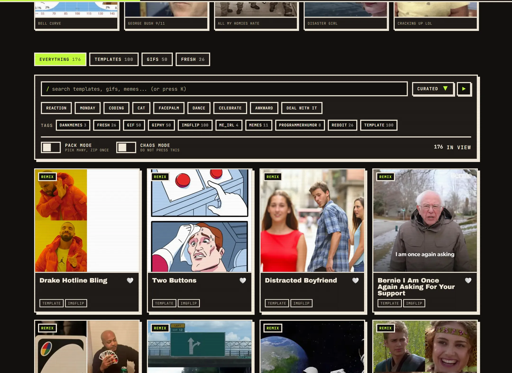
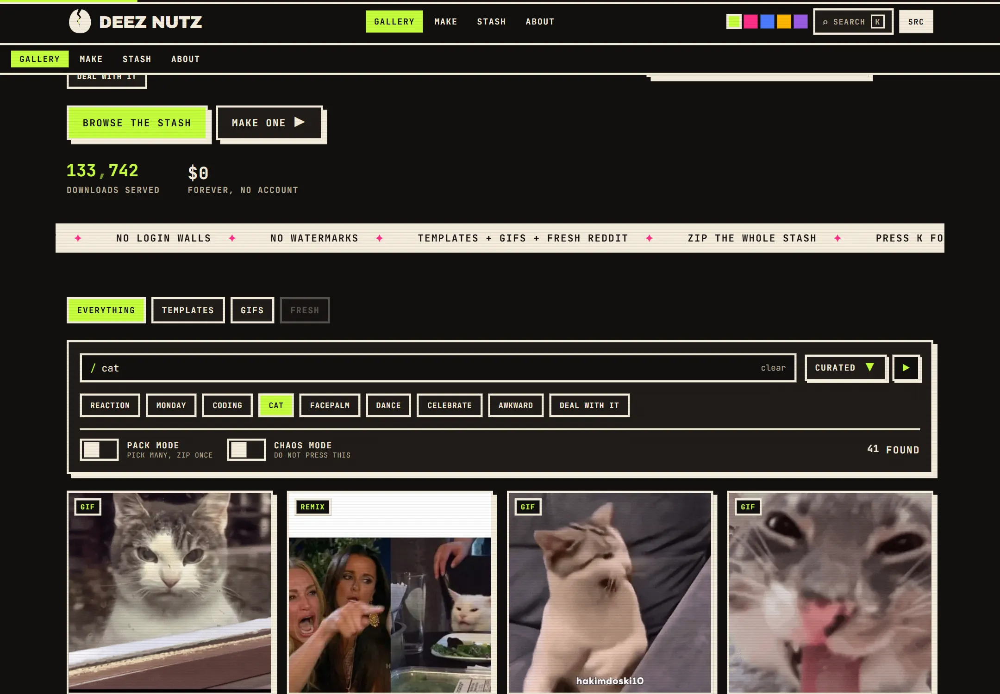
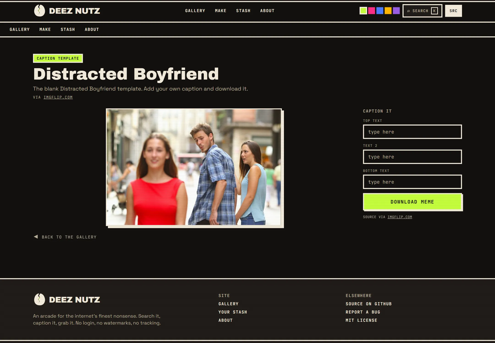
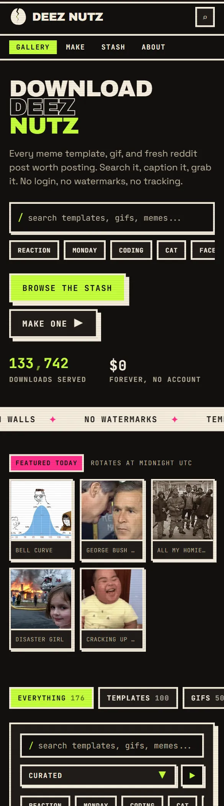

<p align="center">
  
</p>

<p align="center">
  A neo brutalist arcade for the internet's memes, gif templates, and fresh
  reaction images.<br>
  Search it, caption it, grab it. No login, no watermarks, no tracking.
</p>

<p align="center">
  <b><a href="https://deez-nutzz.vercel.app">deez-nutzz.vercel.app</a></b>
</p>

<p align="center">
  <a href="#license"></a>
  
  
  
  
  
  <a href="https://vercel.com/new/clone?repository-url=https://github.com/Abudora-0/Deez-Nutz"></a>
  
</p>

<p align="center">
  <b>Tags:</b>
  memes &middot; gifs &middot; meme generator &middot; meme templates &middot; reaction images &middot; nextjs &middot; react &middot; typescript &middot; tailwindcss &middot; vercel &middot; giphy &middot; imgflip
</p>

---

## What is this

A single page meme arcade with a look that does not come from a component library:
hard shadows, chunky borders, oversized type, a halftone and CRT wash, and every
control tuned to match. The gallery pulls live from three sources, grouped into tabs:

- **Templates.** The top blank templates from imgflip. Open one and caption it right
  in the browser on a canvas. No account, no imgflip watermark, no server round trip.
- **GIFs.** Trending GIFs from Giphy, plus live typed search. Needs one free key.
- **Fresh.** Top SFW image posts of the day from an allowlist of meme subreddits,
  each credited back to its Reddit thread. No key.

Type in the search bar and it queries Giphy and the template list live, scoped by the
tab you are on. Every network source fails soft, so the page always renders.

## Screenshots

| Gallery | Live search | Caption studio |
| --- | --- | --- |
|  |  |  |

<p align="center"></p>

## Features

- **Live search.** Type a word, get real Giphy and template results, scoped by the
  Templates / GIFs tab. Quick chips for common searches.
- **Caption anything.** Caption a blank template, any image on the site, or your own
  upload at `/create`. Impact text on a canvas, downloaded as PNG, nothing uploaded.
- **Slideshow.** A fullscreen roulette through the current results. Arrows to move,
  space to auto advance, `D` to download, `Esc` to close.
- **Download and share.** One click PNG, copy image to clipboard, copy markdown, copy
  the direct image URL, native share, or a share link. Confetti and a live counter
  come free.
- **Download packs.** Flip on pack mode, pick many, pull them all as one zip.
- **Favorites.** Tap the nut on any card to build a stash, saved on device, with its
  own page and a one click zip.
- **Featured today.** A deterministic daily pick, rotating at midnight UTC.
- **Command palette.** Press `K` anywhere to search, navigate, or run an action.
- **Themed controls.** Custom scrollbar, scroll progress bar, rolling odometer, spring
  dropdowns, chunky toggles, an arcade crosshair pointer, five swappable accents.
- **Deep links.** Opening a card shows a shareable modal without leaving the grid; the
  same URL loads a full page on refresh, with its own Open Graph image.
- **Keyboard first**, **Konami code**, reduced motion respected, no account, no
  database, no tracking.

## Tech stack

| Area | Choice |
| --- | --- |
| Framework | Next.js 16 App Router, React 19, streamed with Suspense |
| Language | TypeScript, strict |
| Styling | Tailwind CSS 4 with a custom token layer |
| Animation | Motion, plus CSS keyframes for anything above the fold |
| Primitives | Radix UI (select, switch, context menu), cmdk |
| Images | `next/image` for static thumbnails, plain `` for gifs |
| Content | imgflip and Reddit need no key, Giphy needs a free key |
| Fonts | Archivo Black, Space Grotesk, JetBrains Mono, self hosted |
| Hosting | Vercel, zero config, ISR |

## Getting started

```bash
git clone https://github.com/Abudora-0/Deez-Nutz.git
cd Deez-Nutz
npm install
npm run dev
```

Open [http://localhost:3000](http://localhost:3000).

### Environment

One optional variable. Copy `.env.example` to `.env.local` for the live GIFs tab and
search. On Vercel, add the same value under Project Settings, Environment Variables.

```
GIPHY_API_KEY=your_free_key_from_developers.giphy.com
```

Templates and Fresh need no key. Fresh runs through
[meme-api.com](https://github.com/D3vd/Meme_Api), a free public proxy over an
allowlist of meme subreddits, no registration.

### Scripts

| Command | Does |
| --- | --- |
| `npm run dev` | Dev server |
| `npm run build` | Production build |
| `npm run start` | Serve the production build |
| `npm run lint` | ESLint |
| `npm run typecheck` | TypeScript, no emit |
| `node scripts/shots.mjs` | Regenerate the README screenshots (needs the prod server running) |

## Project structure

```
app/
  page.tsx                hero, then <GallerySection> in a Suspense boundary
  create/                 upload or pick a template, then caption it
  meme/[slug]/            full meme page, prerenders the template slugs, OG image
  @modal/(.)meme/[slug]/  intercepting modal for the same route
  favorites/  about/      supporting pages
  api/search/             live typed search across giphy and templates
  api/download/           allowlisted proxy that forces cross origin downloads
components/
  gallery/                hero, section, client, toolbar, slideshow, featured strip
  meme/                   card, art, detail, download button, caption studio
  chrome/                 header, footer, scroll bar, ticker, konami, toaster
  ui/                     select, switch, odometer, command palette, confetti
  providers/              shared app state (query, slideshow, accents, toasts)
lib/
  gallery.ts              merges the sources, resolves a slug, runs search
  sources/                giphy, imgflip, reddit fetchers, all server only
  query.ts                tag and sort helpers, seeded shuffle
  download.ts             download, clipboard, share, markdown, zip
  favorites.ts  stats.ts  local storage stores
```

## Deployment

Stock Next.js, so Vercel needs no configuration. Import the repo at
[vercel.com/new](https://vercel.com/new), optionally add `GIPHY_API_KEY`, deploy.

[](https://vercel.com/new/clone?repository-url=https://github.com/Abudora-0/Deez-Nutz)

## Contributing

Issues and pull requests welcome. House rules:

- No em dashes anywhere in the code, copy, or commit messages.
- Run `npm run lint`, `npm run typecheck`, and `npm run build` before a PR.

## Disclaimer

Everything in the gallery is fetched live through public APIs and credited in the UI
and in every download: templates from **imgflip**, GIFs from **Giphy**, image posts
from **Reddit** (SFW only, linked back to each thread). This project does not host,
mirror, or claim ownership of that content. Captioned memes are generated in your
browser and never leave it. If you believe something infringes your rights, open an
issue and it will be handled quickly.

## License

[MIT](LICENSE) &copy; 2026 Abudora-0
